<picture>
  <source media="(prefers-color-scheme: dark)" srcset="assets/banner-dark.svg">
  
</picture>

<h1 align="center">Senior Software QA Engineer | QA POC | Test Automation & API Quality</h1>

  <em>I hunt race conditions, interrogate APIs, and turn "works on my machine" into reproducible evidence.</em>

  
  
  

  <a href="#featured-projects">Featured Projects</a> · <a href="#technical-toolkit">Toolkit</a> · <a href="#current-focus">Current Focus</a> · <a href="#lets-talk-quality">Contact</a>

## Professional Snapshot

- **Role:** Senior Software QA Engineer (Level 1) at Enosis Solutions
- **Experience:** Nearly 4 years in software quality assurance
- **Standout scope:** QA POC for a complex enterprise platform migration initiative, owning test strategy, staging acceptance, and release sign-off across the effort
- **Domains:** Migration, platform, revenue-cycle, and production-support teams
- **Based in:** Dhaka, Bangladesh

## Quality Engineering in Practice

What the responsibilities above actually look like day to day:

| Area | In practice |
|---|---|
| Test strategy & planning | Designing test coverage for new and migrated functionality before code freezes, not after |
| Release validation | Staging acceptance and regression planning ahead of production releases |
| Defect investigation | Tracing failures back to root cause instead of stopping at "can't reproduce" |
| Production support | Validating production issues and coordinating HyperCare after major releases |
| Cross-team communication | Acting as the QA point of contact between engineering and product on a platform migration |

## Featured Projects

### [Bug Museum](https://github.com/Mayeen4536/bug-museum)

**Problem:** Most engineering lessons from real production failures evaporate the moment the incident channel goes quiet.

**What I built:** An open-source, evidence-sourced catalog of recurring software failure patterns, written as deep-dive "exhibits" instead of shallow bug lists: each one covers root cause, user impact, developer investigation, QA detection strategy, and an automation strategy.

**The proof:** The flagship exhibit documents a **refresh-token rotation race condition**: how concurrent or retry-triggered refresh attempts race against a single-use rotating token, why the failure looks like random flakiness without correlated logging, and how to deliberately reproduce it under concurrency rather than sequential happy-path testing. It's backed by citations to IETF RFC 9700 and Auth0's rotation documentation, not speculation. The repository also publishes its own architecture decisions and roadmap, with API and Frontend exhibit categories planned next.

**Stack:** Structured Markdown documentation, metadata-tagged exhibits (difficulty, production impact), CC BY 4.0 licensed.

**Repo:** [github.com/Mayeen4536/bug-museum](https://github.com/Mayeen4536/bug-museum)

### [Playwright SauceDemo Automation](https://github.com/Mayeen4536/playwright-saucedemo-automation)

**Problem:** Show how a professional QA/SDET actually structures a UI automation framework, not just that a script can be made to pass.

**What I built:** A Playwright + TypeScript suite built in small, reviewable increments around the Page Object Model, covering login (valid, invalid, locked-out, empty-field), cart, checkout, product sorting, and logout, plus a fully independent API-contract suite against a public booking API using Playwright's own `request` fixture.

**The proof:** Auth-state reuse via `storageState` across separate setup/authenticated/unauthenticated projects, typed data-driven negative-login tests, a custom `loginPage` fixture, and a diagnostics-first failure policy: screenshot, video, and trace retained only on failure, with an additional GitHub Actions `github` reporter in CI. The CI pipeline above reflects the real, current build status of this repository.

**Stack:** Playwright, TypeScript, GitHub Actions, Docker (optional local runner).

**Repo:** [github.com/Mayeen4536/playwright-saucedemo-automation](https://github.com/Mayeen4536/playwright-saucedemo-automation)

### [GroceryMate](https://github.com/Mayeen4536/GroceryMate)

**Problem:** A real household-expense-splitting app needed its UI validated end-to-end before its settlement engine could be trusted: the "is this actually production-ready" question a QA engineer gets handed on a live feature.

**What I validated:** A structured exploratory UI/UX audit, 88 scripted interaction steps across desktop and mobile viewports, covering navigation, forms, dialogs, drawers, empty states, keyboard interaction, rapid-click, invalid input, destructive actions, and browser back navigation.

**The proof:** 9 defects found (3 High, 4 Medium, 2 Low); all 3 High and all 4 Medium severity issues fixed and independently re-verified across a 4-viewport regression matrix, with zero remaining High/Medium issues and zero console errors observed across every run. Each defect is documented with root cause, reproduction steps, and before/after screenshots. Underneath the UI, the engineering layer (settlement algorithm, persistence, AI-parsing, fairness explanations) carries 230+ automated Vitest tests, plus a Playwright end-to-end suite.

**Stack:** React 19, TypeScript (strict), Vite, Tailwind v4, Supabase (Postgres + RLS), Vitest, Playwright.

**Repo:** [github.com/Mayeen4536/GroceryMate](https://github.com/Mayeen4536/GroceryMate)

## Technical Toolkit

### UI Automation
Playwright (C#/NUnit, primary professional stack) · Playwright (TypeScript/JavaScript, personal & portfolio work) · Selenium · Page Object Model · fixtures & auth-state reuse

### API & Data
Postman · REST API contract testing (status, schema, error contracts) · Playwright `request` fixture · SQL / PostgreSQL (Supabase schema & RLS)

### Test Strategy & Delivery
Test strategy & staging acceptance · Regression planning & release validation · Exploratory testing · Defect investigation · Production issue validation & HyperCare coordination

### Engineering Workflow
Git · GitHub Actions · CI/CD pipelines · Docker (local test execution) · Cross-team QA coordination

### Languages & Frameworks
C#, NUnit · JavaScript / TypeScript · Python (scripting)

<strong>🐞 How I Think About Bugs</strong> (click to expand)

 

- A bug that only reproduces "sometimes" isn't a coincidence: it's a missing concurrency test.
- If the fix is "add a try/catch," the investigation isn't finished yet.
- The best regression test is the one written the day a defect is found, using the exact repro steps from the ticket.
- "Works on my machine" is a hypothesis, not a resolution: it means I haven't yet matched the failure's data, timing, or environment.
- A production issue deserves a validation step before it gets called resolved, not just a redeploy.

## Open Source & Engineering Highlights

- Merged a documentation-accuracy fix upstream to [`icalendar`](https://github.com/collective/icalendar) (Python's widely used RFC 5545 calendar library): corrected three broken Sphinx cross-references and reduced the documentation build's warning count. See [PR #1736](https://github.com/collective/icalendar/pull/1736) (merged).
- Maintain [Bug Museum](https://github.com/Mayeen4536/bug-museum) as a public, evidence-sourced engineering knowledge base. See Featured Projects above.

## Current Focus

- Applying AI-assisted engineering to test design, failure investigation, and QA workflows: using LLMs to draft test scenarios and speed up root-cause analysis, while keeping verification human-owned.
- Growing Bug Museum's exhibit collection (API and Frontend categories planned next).
- Moving toward SDET-track roles where automation architecture and API quality sit closer to the center of the job.

## One More Thing

Every project above was tested, manually and automatically, before I called it "done." This README is no exception, and I still expect someone to find a typo in it. Report it as a bug; I'll take it as a compliment.

## Let's Talk Quality

Open to **Senior QA Engineer**, **QA Automation Engineer**, and **SDET** roles.

  
  

